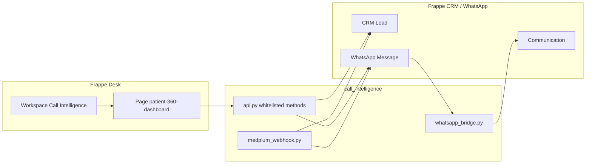

# Call Intelligence

Frappe app for **patient communication and lead qualification** on top of [Frappe CRM](https://github.com/frappe/crm) and [frappe_whatsapp](https://github.com/shridarpatil/frappe_whatsapp). It provides a **Patient 360 Dashboard** desk page, WhatsApp thread mirroring into **Communication**, optional **Medplum** encounter webhooks, and a **Call Intelligence** workspace entry in the sidebar.

## Overview

- **Patient 360 Dashboard** (`patient-360-dashboard`): Lead list, category filters, WhatsApp-style thread, composer (text and attachments), and demo actions (lead qualification, demo lead + message, delete lead).
- **WhatsApp**: Server-side handlers link messages to CRM leads and mirror traffic into **Communication**; outbound sends go through **frappe_whatsapp** where configured.
- **Medplum** (optional): REST hook at `call_intelligence.integrations.medplum_webhook.encounter_webhook` creates CRM leads and sends follow-up WhatsApp sequences when enabled.

## Architecture



- **Fixtures**: `fixtures/workspace.json` defines the **Call Intelligence** workspace (shortcut to Patient 360). `hooks.py` lists the same workspace for `bench export-fixtures` / migrate import. `after_install` creates the workspace if it is still missing so the sidebar entry appears after `bench install-app`.
- **Lead insight storage**: Lead qualification output is stored as an **Info** `Comment` on the lead (prefixed JSON), so no extra Custom Fields are required for basic installs.

## Requirements

- **Frappe** (v14+; v15+ recommended)
- **Frappe CRM** (`crm` app) for **CRM Lead** (Patient 360 APIs target this doctype)
- **frappe_whatsapp** for **WhatsApp Message** and Cloud API sending

Python dependencies outside the bench are **none** (see `requirements.txt`). Install framework and apps on the bench as usual.

## Setup (bench)

1. **Clone** this repository into your bench `apps` folder (or use `bench get-app` from your fork):

   ```bash
   cd /path/to/frappe-bench/apps
   git clone https://github.com/<your-username>/<repo-name>.git call_intelligence
   ```

2. **Install** on your site:

   ```bash
   cd /path/to/frappe-bench
   bench setup requirements
   bench get-app crm
   bench get-app https://github.com/shridarpatil/frappe_whatsapp.git
   bench --site <site-name> install-app crm
   bench --site <site-name> install-app frappe_whatsapp
   bench --site <site-name> install-app call_intelligence
   bench --site <site-name> migrate
   ```

3. **Import fixtures** (if the workspace did not load during migrate):

   ```bash
   bench --site <site-name> import-fixtures
   ```

4. Open **Desk → Call Intelligence** (sidebar) or go to **Patient 360 Dashboard** from the app switcher.

## WhatsApp configuration

Configure **frappe_whatsapp** (Meta WhatsApp Cloud API: Business ID, token, phone number ID, webhook URL, verify token). Point Meta’s webhook to the URL documented in the frappe_whatsapp app (typically under `/api/method/frappe_whatsapp...`).

For **outbound** messages from the Patient 360 composer:

- Within the **24-hour customer care window**, session messages are sent as configured by frappe_whatsapp.
- Outside that window, Meta may require **approved templates**; behaviour depends on your frappe_whatsapp version and template setup.

Optional **test / routing** behaviour (e.g. test numbers) is described in the frappe_whatsapp documentation.

## Medplum webhook (optional)

- Whitelisted method: `call_intelligence.integrations.medplum_webhook.encounter_webhook` (supports `GET` for health checks).
- Configure **Authorization** / **X-Medplum-Signature** as implemented in `medplum_webhook.py` using site config or environment variables (`MEDPLUM_WEBHOOK_BEARER_TOKEN`, `MEDPLUM_WEBHOOK_SECRET`). Do **not** commit secrets; set them in `site_config.json` or the environment.

## Deployment notes

- Run **`bench migrate`** after pulling updates so fixtures and schema stay in sync.
- Ensure **background workers** and **scheduler** are running if frappe_whatsapp relies on them for send/retry.
- For production, serve the site behind HTTPS; configure WhatsApp and any webhooks with the public URL.
- Omit `.env` from deployments; use host secrets or `site_config.json`.

## Screenshots

_Add screenshots of the Patient 360 Dashboard, lead list, and WhatsApp thread here after deployment._

## License

MIT (see `hooks.py` `app_license` and your repository `LICENSE` file if you add one).
