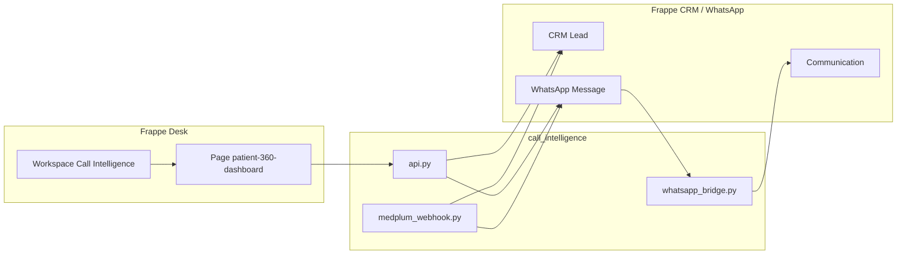

# Call Intelligence

Frappe app for **patient communication and lead qualification** on top of [Frappe CRM](https://github.com/frappe/crm) and [frappe_whatsapp](https://github.com/shridarpatil/frappe_whatsapp). It provides a **Patient 360 Dashboard** desk page, WhatsApp thread mirroring into **Communication**, optional **Medplum** encounter webhooks, and a **Call Intelligence** workspace entry in the sidebar.

**ERPNext is not required.** The intended stack is **Frappe Framework → Frappe CRM (`crm`) → frappe_whatsapp → call_intelligence**.

## Official app directory layout (Frappe)

Modern Frappe loads hooks with **`import call_intelligence.hooks`** (see `frappe.get_module(f"{app}.hooks")`). Therefore **`hooks.py` must live inside the Python package**, not at the repository root.

**`modules.txt` stays at the app root** next to `setup.py` — the framework reads it via `get_app_path("call_intelligence", "modules.txt")`. Do not move `modules.txt` into the inner package.

```
apps/call_intelligence/                    ← app root (this Git repo)
  setup.py
  MANIFEST.in
  requirements.txt
  modules.txt                              ← required here (Frappe API)
  patches.txt
  fixtures/
    workspace.json
    dashboard.json
  call_intelligence/                       ← Python package (import name)
    __init__.py
    hooks.py                               ← required here (import call_intelligence.hooks)
    api.py
    integrations/
    page/
    setup/
    …
  public/
  www/
```

There must be **only one** `hooks.py`, at **`call_intelligence/hooks.py`** (inside the package). **No** `hooks.py` at the app root. **No** `required_apps = ["erpnext"]`.

## Installation (Docker — recommended)

Use **[frappe_docker](https://github.com/frappe/frappe_docker)**.

### 1. Clone and env

```bash
git clone https://github.com/frappe/frappe_docker.git
cd frappe_docker
cp example.env .env
```

Edit `.env` (see [frappe_docker env docs](https://github.com/frappe/frappe_docker/blob/main/docs/02-setup/04-env-variables.md)): set **`DB_PASSWORD`** and any image/version vars your `compose.yaml` expects. **Call Intelligence does not require ERPNext**; use a Frappe/CRM-oriented compose profile if you are not running ERPNext.

### 2. Start stack

```bash
docker compose up -d
```

### 3. New site (example)

```bash
docker compose exec backend bash
bench new-site frontend --db-host db --admin-password <password>
```

Use your site name and DB host from compose (`db` is typical).

### 4. Install apps (order matters)

```bash
bench get-app https://github.com/frappe/crm.git
bench --site frontend install-app crm

bench get-app https://github.com/shridarpatil/frappe_whatsapp.git
bench --site frontend install-app frappe_whatsapp

bench get-app https://github.com/anjaliii-28/call_intelligence.git
bench --site frontend install-app call_intelligence
bench --site frontend migrate
```

After **`bench install-app call_intelligence`**, the site’s **`sites/apps.txt`** (under that site) lists **`call_intelligence`**. If install fails before that step, hooks or packaging are wrong — see [Troubleshooting](#troubleshooting).

### 5. First login

Open the published URL (e.g. **https://localhost:8080**). Desk → **Call Intelligence** or **Patient 360 Dashboard**.

### Optional: fixtures

```bash
bench --site frontend import-fixtures
```

---

## Optional: manual bench (no Docker)

Same **`get-app` / `install-app` / `migrate`** order on a normal bench: **crm → frappe_whatsapp → call_intelligence**.

## Overview

- **Patient 360 Dashboard** (`patient-360-dashboard`): Lead list, category filters, WhatsApp thread, composer, demo actions.
- **WhatsApp**: Links to CRM leads, mirrors to **Communication**; sends via **frappe_whatsapp**.
- **Medplum** (optional): `call_intelligence.integrations.medplum_webhook.encounter_webhook`.

## Architecture



## Fixtures

- **`fixtures/workspace.json`**: **Call Intelligence** workspace. Declared in **`call_intelligence/hooks.py`**. **`after_install`** also creates the workspace if missing.
- **`fixtures/dashboard.json`**: **`[]`** by default so migrate does not import a half-built **Dashboard** (charts are mandatory on that DocType). If you add dashboard rows to this file, set **`"is_standard": 0`** on each so they are not treated as locked standard dashboards (“Cannot edit Standard Dashboards”). Do not add Dashboard to `hooks.py` `fixtures` until each row has valid **Dashboard Chart** links.

## Requirements (summary)

| Piece | Role |
| --- | --- |
| **Frappe** (v14+; v15+ recommended) | Host site, Desk |
| **Frappe CRM** (`crm`) | **CRM Lead** |
| **frappe_whatsapp** | **WhatsApp Message** |
| **ERPNext** | **Not used** for this app |

## WhatsApp & Medplum

Configure **frappe_whatsapp** per its docs. Medplum secrets via `site_config.json` / env — never commit them.

## Troubleshooting

### `No module named 'call_intelligence.hooks'`

Frappe imports **`call_intelligence.hooks`**. The file must be **`apps/call_intelligence/call_intelligence/hooks.py`**. Remove any obsolete **`apps/call_intelligence/hooks.py`** at the app root. Reinstall from this repo:

```bash
rm -rf apps/call_intelligence
bench get-app https://github.com/anjaliii-28/call_intelligence.git
bench --site <site> install-app call_intelligence
```

### `call_intelligence` not in `apps.txt` / install-app fails

- **`install-app` only updates `apps.txt` after a successful install.** Fix hooks/import errors first.
- Ensure you used **`bench get-app`** so the app lives under **`apps/call_intelligence`** with **`setup.py`** at that folder’s root.
- From the app root, verify: `python -c "import sys; sys.path.insert(0,'.'); import call_intelligence.hooks; print(call_intelligence.hooks.app_name)"` → should print **`call_intelligence`**.

### “Cannot edit Standard Dashboards”

Any **Dashboard** you export into fixtures must use **`"is_standard": 0`**. This repo does not ship dashboard rows by default.

### Stray `required_apps = ["erpnext"]`

Must not exist. Grep and remove:

```bash
grep -r "erpnext" apps/call_intelligence/ || true
```

## Screenshots

_Add screenshots here after deployment._

## License

MIT (see `call_intelligence/hooks.py` `app_license`).
