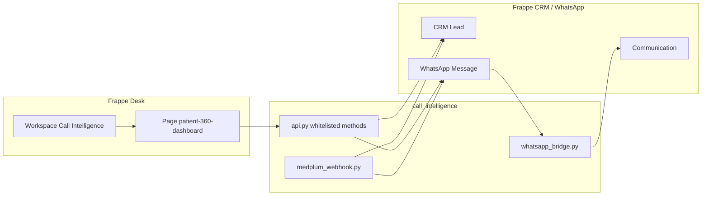

# Call Intelligence

Frappe app for **patient communication and lead qualification** on top of [Frappe CRM](https://github.com/frappe/crm) and [frappe_whatsapp](https://github.com/shridarpatil/frappe_whatsapp). It provides a **Patient 360 Dashboard** desk page, WhatsApp thread mirroring into **Communication**, optional **Medplum** encounter webhooks, and a **Call Intelligence** workspace entry in the sidebar.

**ERPNext is not required.** The intended stack is **Frappe Framework → Frappe CRM (`crm`) → frappe_whatsapp → call_intelligence**. Do not install `erpnext` unless you already run it for other reasons; this app does not depend on it.

## Official app directory layout (Frappe)

Bench loads **one** app package. Hooks and module metadata live at the **app root** (next to `setup.py`). Python code lives in the inner package folder with the same name.

```
apps/call_intelligence/              ← app root (this Git repository)
  hooks.py                           ← ONLY valid hooks file (required)
  modules.txt
  patches.txt
  setup.py
  MANIFEST.in
  requirements.txt
  fixtures/                          ← bench migrate / import-fixtures read from here
    workspace.json
    dashboard.json
  call_intelligence/                 ← Python package (import call_intelligence.api, …)
    __init__.py
    api.py
    integrations/
    page/
    …
  public/
  www/
```

**Do not** add a second `hooks.py` under `apps/call_intelligence/call_intelligence/hooks.py` — that path is wrong and is ignored by Frappe; remove any stray copy. **Do not** set `required_apps = ["erpnext"]`.

## Installation (Docker — recommended)

Use **[frappe_docker](https://github.com/frappe/frappe_docker)**. Adapt compose files to your environment; the steps below match a typical **backend + db + redis** layout.

### 1. Clone and configure

```bash
git clone https://github.com/frappe/frappe_docker.git
cd frappe_docker
cp example.env .env
```

Edit `.env` at minimum:

- **`DB_PASSWORD`** — e.g. `123` for local dev only; use a strong password elsewhere.
- Follow [frappe_docker environment variables](https://github.com/frappe/frappe_docker/blob/main/docs/02-setup/04-env-variables.md) for your compose profile.

**Optional:** Some frappe_docker compose variants define **`ERPNEXT_VERSION`** (e.g. `v16.9.1`) when you intentionally run an **ERPNext**-based image. **Call Intelligence does not require ERPNext** or that variable for the CRM + WhatsApp path; use the variables your chosen `compose.yaml` documents (often Frappe / custom image tags instead).

### 2. Start containers

```bash
docker compose up -d
```

Wait until **backend**, **db**, and **redis** (and any proxy) are healthy. Find the bench container name:

```bash
docker compose ps
# Often: docker compose exec backend bash
```

### 3. New site (example)

Inside the backend container (or `docker compose exec backend bash`):

```bash
bench new-site frontend --db-host db --admin-password <admin-password>
```

Use your real site name if not `frontend`, and the DB host/service name your compose file uses (`db` is common in frappe_docker).

### 4. Install apps (order matters)

```bash
bench get-app https://github.com/frappe/crm.git
bench --site frontend install-app crm

bench get-app https://github.com/shridarpatil/frappe_whatsapp.git
bench --site frontend install-app frappe_whatsapp

bench get-app https://github.com/anjaliii-28/call_intelligence.git
bench --site frontend install-app call_intelligence

bench --site frontend migrate
```

Replace `frontend` with your site name. Use your fork URL for `call_intelligence` if you did not clone from GitHub.

### 5. First login

Open the URL frappe_docker publishes (often **https://localhost:8080** or your `.env` host). Desk → **Call Intelligence** or **Patient 360 Dashboard**.

### 6. Optional: import fixtures manually

If the workspace did not appear after migrate:

```bash
bench --site frontend import-fixtures
```

---

## Quick reference (Docker)

- **Run bench:** `docker compose exec backend bench …` (or `docker exec -it frappe_docker-backend-1 bash` then `bench …`).
- **Bind-mount this app for development:** follow [frappe_docker development](https://github.com/frappe/frappe_docker/tree/main/docs/05-development); the app directory name must be **`call_intelligence`** under `apps/`.

### Without Frappe CRM (limited)

If **`crm`** is not installed, APIs may fall back to the generic **`Lead`** doctype when **CRM Lead** is missing. **Demo patient**, full Patient 360 field mapping, and **Medplum** lead creation expect **Frappe CRM** — install **`crm`** for the supported path.

---

## Optional: manual bench (no Docker)

Install the [Frappe framework](https://docs.frappe.io/framework/user/en/installation), create a site, then run the same **`bench get-app`** / **`install-app`** / **`migrate`** order: **crm → frappe_whatsapp → call_intelligence**.

## Overview

- **Patient 360 Dashboard** (`patient-360-dashboard`): Lead list, category filters, WhatsApp-style thread, composer (text and attachments), and demo actions (lead qualification, demo lead + message, delete lead).
- **WhatsApp**: Server-side handlers link messages to CRM leads and mirror traffic into **Communication**; outbound sends go through **frappe_whatsapp** where configured.
- **Medplum** (optional): REST hook at `call_intelligence.integrations.medplum_webhook.encounter_webhook` creates CRM leads and sends follow-up WhatsApp sequences when enabled.

## Architecture



## Fixtures (Workspace and Dashboard)

- **`fixtures/workspace.json`**: **Call Intelligence** workspace (shortcut to Patient 360). Listed in `hooks.py` for migrate; **`after_install`** also creates the workspace if it is still missing.
- **`fixtures/dashboard.json`**: Shipped as an **empty array `[]`** so migrate does not import a **Dashboard** document. In Frappe, **Dashboard** requires at least one **chart** link; importing an incomplete dashboard breaks install. If you export a dashboard for this app later, set **`"is_standard": 0`** (not `1`) so Desk does not treat it as a locked standard dashboard (“Cannot edit Standard Dashboards”).

## Requirements (summary)

| Piece | Role |
| --- | --- |
| **Frappe** (v14+; v15+ recommended) | Host site, Desk, migrations |
| **Frappe CRM** (`crm`) | **CRM Lead** — full Patient 360 + Medplum + demo actions |
| **frappe_whatsapp** | **WhatsApp Message**, Cloud API sending |
| **ERPNext** | **Not used** — omit unless you need it for something else |

Python: **no extra PyPI packages** beyond the bench (see `requirements.txt`).

## WhatsApp configuration

Configure **frappe_whatsapp** (Meta WhatsApp Cloud API). Point Meta’s webhook at your site’s public URL. See the frappe_whatsapp docs for paths (typically `/api/method/frappe_whatsapp...`).

## Medplum webhook (optional)

- Whitelisted method: `call_intelligence.integrations.medplum_webhook.encounter_webhook` (supports `GET` for health checks).
- Configure **Authorization** / **X-Medplum-Signature** via `site_config.json` or environment (`MEDPLUM_WEBHOOK_BEARER_TOKEN`, `MEDPLUM_WEBHOOK_SECRET`). Do **not** commit secrets.

## Deployment notes

- After pulling app updates: **`bench migrate`** in the backend container.
- Keep workers, scheduler, and Redis running per your compose file.
- Do not commit `.env`; use secrets or Docker secrets in production.

## Troubleshooting

### “Cannot edit Standard Dashboards”

Exported **Dashboard** fixtures must use **`"is_standard": 0`**. This repo does not ship dashboard rows in `hooks.py` fixtures; extend `fixtures/dashboard.json` only after you have valid **Dashboard Chart** links, or create dashboards from Desk.

### `No module named 'hooks'` or wrong hooks picked up

- Valid file: **`apps/call_intelligence/hooks.py`** (app root only).
- **Delete** any stray **`apps/call_intelligence/call_intelligence/hooks.py`** and clear bytecode:

```bash
rm -f apps/call_intelligence/call_intelligence/hooks.py
find apps/call_intelligence -type f \( -name "*.pyc" -o -name "*.pyo" \) -delete 2>/dev/null
find apps/call_intelligence -type d -name __pycache__ -exec rm -rf {} + 2>/dev/null; true
bench restart
```

### `required_apps = ["erpnext"]`

This app **must not** declare ERPNext. The repository root **`hooks.py`** does not include it. If you still see it after `grep`, remove stray files as above and **`git pull`** a clean copy of this app.

## Screenshots

_Add screenshots of the Patient 360 Dashboard, lead list, and WhatsApp thread here after deployment._

## License

MIT (see `hooks.py` `app_license` and your repository `LICENSE` file if you add one).
