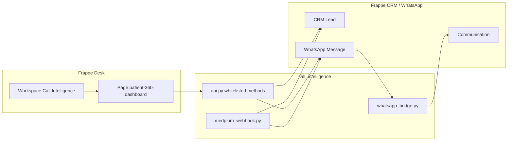

# Call Intelligence

Frappe app for **patient communication and lead qualification** on top of [Frappe CRM](https://github.com/frappe/crm) and [frappe_whatsapp](https://github.com/shridarpatil/frappe_whatsapp). It provides a **Patient 360 Dashboard** desk page, WhatsApp thread mirroring into **Communication**, optional **Medplum** encounter webhooks, and a **Call Intelligence** workspace entry in the sidebar.

**ERPNext is not required.** The intended stack is **Frappe Framework → Frappe CRM (`crm`) → frappe_whatsapp → call_intelligence**. Do not install `erpnext` unless you already run it for other reasons; this app does not depend on it.

## Quick start (Docker)

Use the official **[frappe_docker](https://github.com/frappe/frappe_docker)** stack so you do **not** install bench, Python, or MariaDB on your host. Below assumes you already followed the frappe_docker **Getting started** guide (clone repo, copy `example.env` → `.env`, adjust passwords/ports, bring services up).

### 1. Prerequisites

- [Docker](https://docs.docker.com/get-docker/) and [Docker Compose](https://docs.docker.com/compose/) (e.g. Docker Desktop on macOS/Windows)
- A working frappe_docker checkout — see [frappe_docker documentation](https://github.com/frappe/frappe_docker#documentation) and [environment variables](https://github.com/frappe/frappe_docker/blob/main/docs/02-setup/04-env-variables.md)

### 2. Start the stack

From your `frappe_docker` directory (use the same `compose.yaml` + overrides you normally use, e.g. MariaDB + Redis):

```bash
docker compose up -d
```

Wait until **backend**, **db**, and **redis** services are healthy. Service names can differ by version; list them with:

```bash
docker compose ps
```

The container where you run **`bench`** is usually named **`backend`** in compose (e.g. `frappe_docker-backend-1`).

### 3. Install apps inside the backend container

Run **`bench`** inside the **backend** service (replace `<site-name>` with your site, e.g. `frontend` or the host you configured):

```bash
# From frappe_docker directory — adjust if your compose project name differs
docker compose exec backend bench get-app https://github.com/frappe/crm.git
docker compose exec backend bench get-app https://github.com/shridarpatil/frappe_whatsapp.git
docker compose exec backend bench get-app https://github.com/anjaliii-28/call_intelligence.git

docker compose exec backend bench --site <site-name> install-app crm
docker compose exec backend bench --site <site-name> install-app frappe_whatsapp
docker compose exec backend bench --site <site-name> install-app call_intelligence
docker compose exec backend bench --site <site-name> migrate
```

Install order: **crm → frappe_whatsapp → call_intelligence**, then **migrate**.

If your compose file names the bench service differently (e.g. `frappe`), use that instead of `backend`:

```bash
docker compose exec <bench-service-name> bench ...
```

### 4. Fixtures and first login

```bash
docker compose exec backend bench --site <site-name> import-fixtures
```

Open the site URL frappe_docker exposes (often **https://localhost:8080** or the host in your `.env`). Log in to **Desk → Call Intelligence** or open **Patient 360 Dashboard**.

### 5. Mounting this app from a local clone (development)

To edit `call_intelligence` on your machine and see changes in the container, follow frappe_docker’s **development** / **bind mount** patterns (e.g. `development` overrides, `apps` volume, or custom `Containerfile`). The app must live under the bench `apps` directory inside the container as **`call_intelligence`**. See [frappe_docker development docs](https://github.com/frappe/frappe_docker/tree/main/docs/05-development).

### Without Frappe CRM (limited)

If **`crm`** is not installed, the app still loads and APIs may fall back to the generic **`Lead`** doctype when **CRM Lead** is missing. **Demo patient**, full Patient 360 field mapping, and **Medplum** lead creation expect **Frappe CRM** — install **`crm`** for the supported path.

---

## Optional: manual bench (no Docker)

If you prefer a local bench without Docker, install the [Frappe framework](https://docs.frappe.io/framework/user/en/installation), create a site, then run the same **`bench get-app`** / **`install-app`** / **`migrate`** sequence on the host. App order is unchanged: **crm → frappe_whatsapp → call_intelligence**.

## Overview

- **Patient 360 Dashboard** (`patient-360-dashboard`): Lead list, category filters, WhatsApp-style thread, composer (text and attachments), and demo actions (lead qualification, demo lead + message, delete lead).
- **WhatsApp**: Server-side handlers link messages to CRM leads and mirror traffic into **Communication**; outbound sends go through **frappe_whatsapp** where configured.
- **Medplum** (optional): REST hook at `call_intelligence.integrations.medplum_webhook.encounter_webhook` creates CRM leads and sends follow-up WhatsApp sequences when enabled.

## Architecture



- **Fixtures**: `fixtures/workspace.json` defines the **Call Intelligence** workspace (shortcut to Patient 360). `hooks.py` lists the same workspace for `bench export-fixtures` / migrate import. `after_install` creates the workspace if it is still missing so the sidebar entry appears after `bench install-app`.
- **Lead insight storage**: Lead qualification output is stored as an **Info** `Comment` on the lead (prefixed JSON), so no extra Custom Fields are required for basic installs.

## Requirements (summary)

| Piece | Role |
| --- | --- |
| **Frappe** (v14+; v15+ recommended) | Host site, Desk, migrations |
| **Frappe CRM** (`crm`) | **CRM Lead** — full Patient 360 + Medplum + demo actions |
| **frappe_whatsapp** | **WhatsApp Message**, Cloud API sending |
| **ERPNext** | **Not used** — omit unless you need it for something else |

Python: **no extra PyPI packages** beyond the bench (see `requirements.txt`).

## WhatsApp configuration

Configure **frappe_whatsapp** (Meta WhatsApp Cloud API: Business ID, token, phone number ID, webhook URL, verify token). Point Meta’s webhook to the public URL of your site (through frappe_docker’s reverse proxy / Traefik / nginx as you have it set up). In-container paths are documented in the frappe_whatsapp app (typically under `/api/method/frappe_whatsapp...`).

For **outbound** messages from the Patient 360 composer:

- Within the **24-hour customer care window**, session messages are sent as configured by frappe_whatsapp.
- Outside that window, Meta may require **approved templates**; behaviour depends on your frappe_whatsapp version and template setup.

Optional **test / routing** behaviour (e.g. test numbers) is described in the frappe_whatsapp documentation.

## Medplum webhook (optional)

- Whitelisted method: `call_intelligence.integrations.medplum_webhook.encounter_webhook` (supports `GET` for health checks).
- Configure **Authorization** / **X-Medplum-Signature** as implemented in `medplum_webhook.py` using site config or environment variables (`MEDPLUM_WEBHOOK_BEARER_TOKEN`, `MEDPLUM_WEBHOOK_SECRET`). Do **not** commit secrets; set them in `site_config.json` or the environment exposed into the backend container.

## Deployment notes

- After pulling app updates: **`bench migrate`** inside the backend container (same as host bench).
- Keep **workers**, **scheduler**, and **Redis** services running as in your frappe_docker compose file.
- For production, use HTTPS and frappe_docker’s production examples (reverse proxy, TLS).
- Do not commit `.env`; inject secrets via host env or Docker secrets.

## Screenshots

_Add screenshots of the Patient 360 Dashboard, lead list, and WhatsApp thread here after deployment._

## License

MIT (see `hooks.py` `app_license` and your repository `LICENSE` file if you add one).
