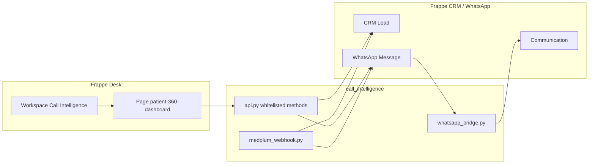

# Call Intelligence

Frappe app for **patient communication and lead qualification** on top of [Frappe CRM](https://github.com/frappe/crm) and [frappe_whatsapp](https://github.com/shridarpatil/frappe_whatsapp). It provides a **Patient 360 Dashboard** desk page, WhatsApp thread mirroring into **Communication**, optional **Medplum** encounter webhooks, and a **Call Intelligence** workspace entry in the sidebar.

**ERPNext is not required.** The intended stack is **Frappe Framework → Frappe CRM (`crm`) → frappe_whatsapp → call_intelligence**. Do not install `erpnext` unless you already run it for other reasons; this app does not depend on it.

## If you do not have Frappe CRM yet — start here

Call Intelligence is **not** a stand-alone product: it runs **inside a Frappe site** and expects a **leads** doctype plus WhatsApp. Treat the following as the minimum path for someone starting from zero.

### 1. Frappe bench and a site (if you have neither)

Install [Frappe Bench](https://docs.frappe.io/framework/user/en/installation), create a bench, create a site, and start Redis / workers as described in the framework docs. You need a working **Desk** login before installing apps below.

### 2. Install Frappe CRM (recommended)

**Patient 360 is designed around [Frappe CRM](https://github.com/frappe/crm)** and the **CRM Lead** doctype (lead name, mobile, CRM-specific fields, Medplum lead creation, and the in-app **demo lead** button all assume `crm` is installed).

From your bench:

```bash
cd /path/to/frappe-bench
bench get-app https://github.com/frappe/crm.git
bench --site <site-name> install-app crm
bench --site <site-name> migrate
```

Confirm in Desk that **CRM Lead** exists and you can open the CRM app. If this step is skipped, read **Without Frappe CRM** below.

### 3. Install frappe_whatsapp

```bash
bench get-app https://github.com/shridarpatil/frappe_whatsapp.git
bench --site <site-name> install-app frappe_whatsapp
bench --site <site-name> migrate
```

### 4. Install this app

```bash
bench get-app https://github.com/<your-org>/call_intelligence.git
bench --site <site-name> install-app call_intelligence
bench --site <site-name> migrate
```

Order matters: **framework → site → CRM (recommended) → frappe_whatsapp → call_intelligence**.

### Without Frappe CRM (limited)

If you **cannot** install Frappe CRM, the app still loads and the dashboard APIs fall back to the core **`Lead`** doctype when **CRM Lead** is missing. Expect **gaps**:

- Field names differ between the generic **`Lead`** doctype (when present on your site) and **CRM Lead**, so list cards and detail panels may show empty or “—” until you align data or extend the app.
- **Create demo patient** (and anything that hard-codes `CRM Lead`) will not work until Frappe CRM is installed.
- **Medplum → create lead** in `medplum_webhook.py` expects **CRM Lead**; that flow will fail without `crm`.

For the intended experience, **install Frappe CRM first**, then frappe_whatsapp, then Call Intelligence.

## Overview

- **Patient 360 Dashboard** (`patient-360-dashboard`): Lead list, category filters, WhatsApp-style thread, composer (text and attachments), and demo actions (lead qualification, demo lead + message, delete lead).
- **WhatsApp**: Server-side handlers link messages to CRM leads and mirror traffic into **Communication**; outbound sends go through **frappe_whatsapp** where configured.
- **Medplum** (optional): REST hook at `call_intelligence.integrations.medplum_webhook.encounter_webhook` creates CRM leads and sends follow-up WhatsApp sequences when enabled.

## Architecture



- **Fixtures**: `fixtures/workspace.json` defines the **Call Intelligence** workspace (shortcut to Patient 360). `hooks.py` lists the same workspace for `bench export-fixtures` / migrate import. `after_install` creates the workspace if it is still missing so the sidebar entry appears after `bench install-app`.
- **Lead insight storage**: Lead qualification output is stored as an **Info** `Comment` on the lead (prefixed JSON), so no extra Custom Fields are required for basic installs.

## Requirements (summary)

| Piece | Role |
| --- | --- |
| **Frappe** (v14+; v15+ recommended) | Host site, Desk, migrations |
| **Frappe CRM** (`crm`) | **CRM Lead** — full Patient 360 + Medplum + demo actions |
| **frappe_whatsapp** | **WhatsApp Message**, Cloud API sending |
| **ERPNext** | **Not used** — omit unless you need it for something else |

Python: **no extra PyPI packages** beyond the bench (see `requirements.txt`).

## Setup (bench) — condensed

Follow **[If you do not have Frappe CRM yet — start here](#if-you-do-not-have-frappe-crm-yet--start-here)** first. Quick reference:

1. `bench get-app` for **crm**, **frappe_whatsapp**, and **call_intelligence** (in that order).
2. `bench --site <site> install-app` in the same order, then **`migrate`** after each app or once at the end.
3. Optional: `bench setup requirements` when pulling new apps.
4. **Fixtures**: if the workspace is missing after migrate:

   ```bash
   bench --site <site-name> import-fixtures
   ```

5. Open **Desk → Call Intelligence** or **Patient 360 Dashboard** from the app switcher.

## WhatsApp configuration

Configure **frappe_whatsapp** (Meta WhatsApp Cloud API: Business ID, token, phone number ID, webhook URL, verify token). Point Meta’s webhook to the URL documented in the frappe_whatsapp app (typically under `/api/method/frappe_whatsapp...`).

For **outbound** messages from the Patient 360 composer:

- Within the **24-hour customer care window**, session messages are sent as configured by frappe_whatsapp.
- Outside that window, Meta may require **approved templates**; behaviour depends on your frappe_whatsapp version and template setup.

Optional **test / routing** behaviour (e.g. test numbers) is described in the frappe_whatsapp documentation.

## Medplum webhook (optional)

- Whitelisted method: `call_intelligence.integrations.medplum_webhook.encounter_webhook` (supports `GET` for health checks).
- Configure **Authorization** / **X-Medplum-Signature** as implemented in `medplum_webhook.py` using site config or environment variables (`MEDPLUM_WEBHOOK_BEARER_TOKEN`, `MEDPLUM_WEBHOOK_SECRET`). Do **not** commit secrets; set them in `site_config.json` or the environment.

## Deployment notes

- Run **`bench migrate`** after pulling updates so fixtures and schema stay in sync.
- Ensure **background workers** and **scheduler** are running if frappe_whatsapp relies on them for send/retry.
- For production, serve the site behind HTTPS; configure WhatsApp and any webhooks with the public URL.
- Omit `.env` from deployments; use host secrets or `site_config.json`.

## Screenshots

_Add screenshots of the Patient 360 Dashboard, lead list, and WhatsApp thread here after deployment._

## License

MIT (see `hooks.py` `app_license` and your repository `LICENSE` file if you add one).
